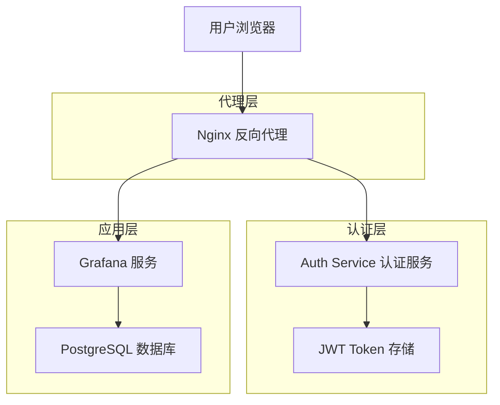
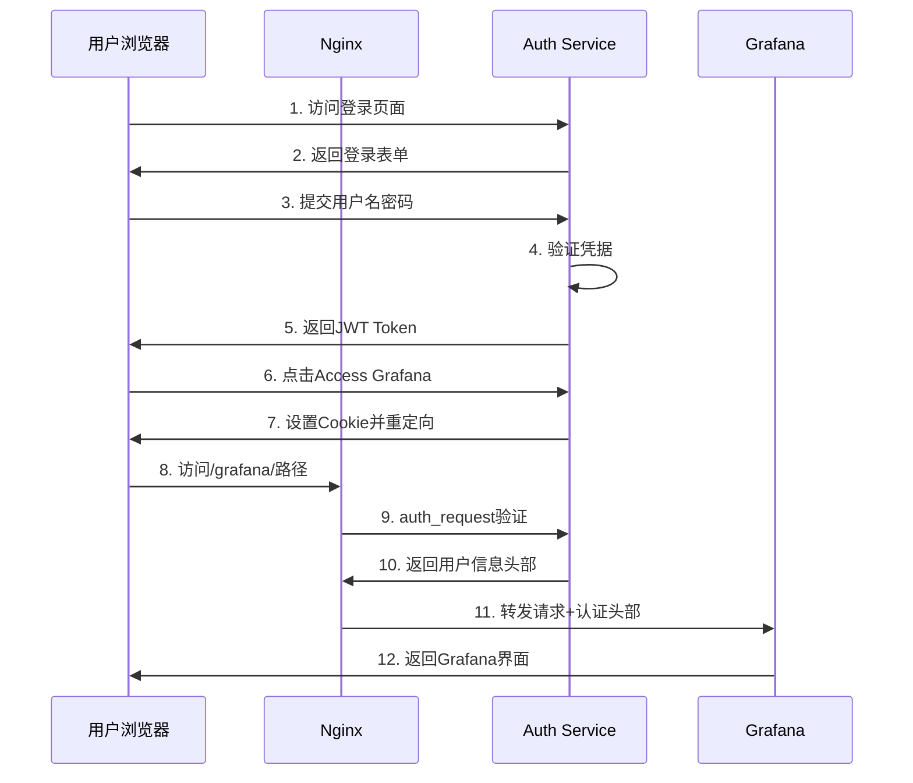
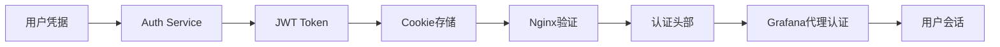
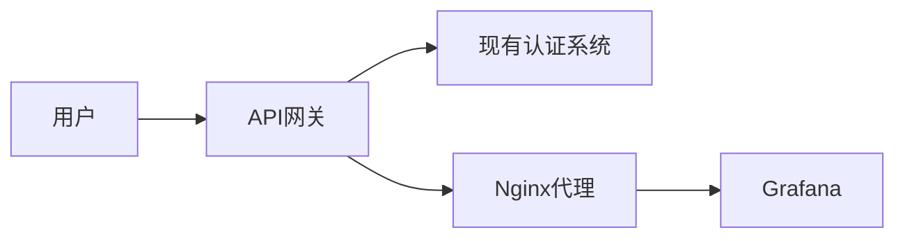
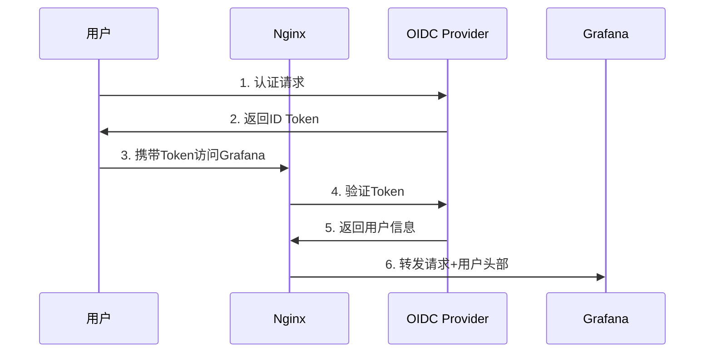

# Grafana 认证代理方案架构文档

## 1. 整体架构设计

### 1.1 系统组件关系图



### 1.2 认证流程架构图



### 1.3 数据流向图



## 2. 方案逻辑详解

### 2.1 用户认证流程步骤

1. **用户访问**: 用户通过浏览器访问认证服务的登录页面
2. **凭据验证**: Auth Service验证用户名和密码
3. **Token生成**: 验证成功后生成JWT Token
4. **Token存储**: 将Token存储在浏览器Cookie中
5. **访问请求**: 用户点击"Access Grafana"链接
6. **代理验证**: Nginx通过auth_request模块验证Token
7. **头部设置**: 验证成功后设置认证头部
8. **服务转发**: 将请求转发给Grafana并携带认证信息
9. **会话建立**: Grafana基于代理认证创建用户会话

### 2.2 JWT Token生成和验证机制

#### Token结构
```json
{
  "header": {
    "alg": "HS256",
    "typ": "JWT"
  },
  "payload": {
    "user_id": 1,
    "email": "admin@example.com",
    "name": "Admin User",
    "sub": "admin",
    "exp": 1640995200,
    "iat": 1640908800
  },
  "signature": "HMACSHA256(...)"
}
```

#### 验证流程
1. 从Cookie或Authorization头部提取Token
2. 验证Token签名的有效性
3. 检查Token是否过期
4. 提取用户信息用于后续认证

### 2.3 Nginx auth_request工作原理

```nginx
location /grafana/ {
    # 发送认证请求到内部端点
    auth_request /auth;
    
    # 从认证响应中提取用户信息
    auth_request_set $auth_user $upstream_http_x_auth_user;
    auth_request_set $auth_name $upstream_http_x_auth_name;
    
    # 设置Grafana需要的认证头部
    proxy_set_header X-WEBAUTH-USER $auth_user;
    proxy_set_header X-WEBAUTH-NAME $auth_name;
    
    # 转发到Grafana服务
    proxy_pass http://grafana/;
}

location = /auth {
    internal;
    proxy_pass http://auth-service/verify;
    proxy_pass_request_body off;
    proxy_set_header Content-Length "";
    proxy_set_header Cookie $http_cookie;
}
```

### 2.4 Grafana代理认证配置原理

```ini
[auth.proxy]
enabled = true
header_name = X-WEBAUTH-USER
header_property = username
auto_sign_up = true
sync_ttl = 60
whitelist = 127.0.0.1, ::1
headers = Name:X-WEBAUTH-NAME
```

## 3. 核心组件说明

### 3.1 Auth Service职责和功能

#### 主要职责
- **用户认证**: 验证用户凭据的有效性
- **Token管理**: 生成、验证和刷新JWT Token
- **会话管理**: 管理用户登录状态
- **用户信息**: 提供用户基本信息给下游服务

#### 核心API端点
- `GET /`: 登录页面
- `POST /login`: 用户登录认证
- `GET /verify`: Token验证端点
- `GET /grafana/auth`: Grafana访问入口

### 3.2 Nginx代理配置详解

#### 关键配置项
```nginx
# 支持多域名访问
server_name localhost 127.0.0.1;

# JWT Token提取
map $http_authorization $jwt_token {
    ~Bearer(.*) $1;
    default "";
}

# 认证请求配置
location = /auth {
    internal;
    proxy_pass http://auth-service/verify;
    proxy_set_header Cookie $http_cookie;
    proxy_set_header X-JWT-Token $jwt_token;
}
```

### 3.3 Grafana代理认证配置

#### 配置说明
- `enabled = true`: 启用代理认证模式
- `header_name`: 指定用户名头部字段
- `auto_sign_up = true`: 自动创建新用户
- `whitelist`: 允许的代理IP地址
- `headers`: 额外的用户信息头部映射

### 3.4 Cookie和Header传递机制

#### Cookie设置
```go
cookie := &http.Cookie{
    Name:     "grafana_jwt_token",
    Value:    tokenString,
    Path:     "/",
    HttpOnly: false,
    MaxAge:   86400,
    SameSite: http.SameSiteLaxMode,
}
```

#### Header传递
- `X-WEBAUTH-USER`: 用户名
- `X-WEBAUTH-NAME`: 显示名称
- `Authorization`: Bearer Token
- `Cookie`: 认证Cookie

## 4. 不使用auth-service demo的接入方案

### 4.1 集成现有认证系统

#### 方案一：API网关集成


**实现步骤**:
1. 在API网关中配置认证路由
2. 现有认证系统提供Token验证接口
3. 配置Nginx调用API网关的验证端点
4. 设置正确的认证头部映射

#### 方案二：认证中间件
```python
# Flask示例
from flask import Flask, request, jsonify
import jwt

app = Flask(__name__)

@app.route('/verify')
def verify_token():
    token = request.cookies.get('auth_token')
    if not token:
        return '', 401
    
    try:
        payload = jwt.decode(token, SECRET_KEY, algorithms=['HS256'])
        return '', 200, {
            'X-Auth-User': payload['username'],
            'X-Auth-Name': payload['display_name']
        }
    except jwt.InvalidTokenError:
        return '', 401
```

### 4.2 自定义认证服务开发指南

#### 最小化认证服务实现
```go
package main

import (
    "net/http"
    "github.com/golang-jwt/jwt/v5"
)

type AuthService struct {
    jwtSecret []byte
    userStore UserStore // 你的用户存储接口
}

// 必需的端点实现
func (a *AuthService) VerifyHandler(w http.ResponseWriter, r *http.Request) {
    // 1. 从Cookie或Header提取Token
    token := extractToken(r)
    
    // 2. 验证Token
    claims, err := a.validateToken(token)
    if err != nil {
        http.Error(w, "Unauthorized", 401)
        return
    }
    
    // 3. 设置认证头部
    w.Header().Set("X-WEBAUTH-USER", claims.Username)
    w.Header().Set("X-WEBAUTH-NAME", claims.DisplayName)
    w.WriteHeader(200)
}
```

#### 接口规范
```yaml
# OpenAPI 3.0规范
paths:
  /verify:
    get:
      summary: Token验证端点
      parameters:
        - name: Cookie
          in: header
          schema:
            type: string
      responses:
        '200':
          description: 验证成功
          headers:
            X-WEBAUTH-USER:
              schema:
                type: string
            X-WEBAUTH-NAME:
              schema:
                type: string
        '401':
          description: 验证失败
```

### 4.3 第三方认证系统对接方案

#### Keycloak集成
```nginx
location = /auth {
    internal;
    proxy_pass http://keycloak:8080/auth/realms/myrealm/protocol/openid_connect/userinfo;
    proxy_pass_request_body off;
    proxy_set_header Content-Length "";
    proxy_set_header Authorization $http_authorization;
}

location /grafana/ {
    auth_request /auth;
    auth_request_set $user $upstream_http_preferred_username;
    auth_request_set $name $upstream_http_name;
    
    proxy_set_header X-WEBAUTH-USER $user;
    proxy_set_header X-WEBAUTH-NAME $name;
    proxy_pass http://grafana/;
}
```

#### Auth0集成
```javascript
// Node.js Express中间件
const jwt = require('jsonwebtoken');
const jwksClient = require('jwks-rsa');

const client = jwksClient({
  jwksUri: 'https://your-domain.auth0.com/.well-known/jwks.json'
});

app.get('/verify', async (req, res) => {
  const token = req.headers.authorization?.replace('Bearer ', '');
  
  try {
    const decoded = jwt.verify(token, getKey, {
      audience: 'your-api-identifier',
      issuer: 'https://your-domain.auth0.com/',
      algorithms: ['RS256']
    });
    
    res.set({
      'X-WEBAUTH-USER': decoded.sub,
      'X-WEBAUTH-NAME': decoded.name
    });
    res.status(200).send();
  } catch (err) {
    res.status(401).send();
  }
});
```

### 4.4 OIDC/SAML等标准协议集成

#### OIDC集成架构


#### SAML集成配置
```xml
<!-- SAML SP配置示例 -->
<EntityDescriptor entityID="https://your-grafana.com/saml">
  <SPSSODescriptor>
    <AssertionConsumerService
      Binding="urn:oasis:names:tc:SAML:2.0:bindings:HTTP-POST"
      Location="https://your-grafana.com/saml/acs"
      index="0" />
  </SPSSODescriptor>
</EntityDescriptor>
```

## 5. 配置参考和最佳实践

### 5.1 生产环境配置建议

#### Nginx配置优化
```nginx
# 启用HTTP/2
listen 443 ssl http2;

# SSL配置
ssl_certificate /path/to/cert.pem;
ssl_certificate_key /path/to/key.pem;
ssl_protocols TLSv1.2 TLSv1.3;

# 安全头部
add_header X-Frame-Options DENY;
add_header X-Content-Type-Options nosniff;
add_header X-XSS-Protection "1; mode=block";

# 认证缓存
proxy_cache_path /var/cache/nginx/auth levels=1:2 keys_zone=auth:10m max_size=1g inactive=60m;

location = /auth {
    internal;
    proxy_cache auth;
    proxy_cache_valid 200 5m;
    proxy_cache_key "$http_cookie$http_authorization";
    proxy_pass http://auth-service/verify;
}
```

#### Auth Service配置
```yaml
# docker-compose.yml
auth-service:
  image: your-auth-service:latest
  environment:
    - JWT_SECRET=${JWT_SECRET}
    - JWT_EXPIRY=24h
    - RATE_LIMIT=100
    - LOG_LEVEL=info
  deploy:
    replicas: 2
    resources:
      limits:
        memory: 256M
        cpus: '0.5'
```

### 5.2 安全性考虑

#### Token安全
- 使用强随机密钥生成JWT Secret
- 设置合理的Token过期时间
- 实现Token刷新机制
- 考虑使用非对称加密算法

#### Cookie安全
```go
cookie := &http.Cookie{
    Name:     "grafana_jwt_token",
    Value:    tokenString,
    Path:     "/",
    Domain:   ".yourdomain.com",
    Secure:   true,  // 仅HTTPS
    HttpOnly: true,  // 防止XSS
    SameSite: http.SameSiteStrictMode,
}
```

#### 网络安全
- 使用HTTPS加密传输
- 配置防火墙规则
- 限制认证服务访问IP
- 实现请求频率限制

### 5.3 性能优化建议

#### 缓存策略
```nginx
# 认证结果缓存
proxy_cache_path /var/cache/nginx/auth levels=1:2 keys_zone=auth:10m;

location = /auth {
    proxy_cache auth;
    proxy_cache_valid 200 5m;  # 成功认证缓存5分钟
    proxy_cache_valid 401 1m;  # 失败认证缓存1分钟
}
```

#### 连接池配置
```nginx
upstream auth-service {
    server auth-service:8080 max_fails=3 fail_timeout=30s;
    keepalive 32;
}

upstream grafana {
    server grafana:3000 max_fails=3 fail_timeout=30s;
    keepalive 32;
}
```

#### 监控指标
- 认证请求响应时间
- 认证成功/失败率
- Token验证缓存命中率
- 服务健康状态

### 5.4 故障排查指南

#### 常见问题诊断

**问题1: 401 Unauthorized错误**
```bash
# 检查认证服务日志
docker logs auth-service

# 检查Nginx认证日志
tail -f /var/log/nginx/auth_error.log

# 验证Token有效性
curl -H "Cookie: grafana_jwt_token=YOUR_TOKEN" http://localhost/auth
```

**问题2: 重定向循环**
```bash
# 检查Nginx配置
nginx -t

# 验证代理配置
curl -I http://localhost/grafana/

# 检查Grafana代理认证配置
grep -A 10 "\[auth.proxy\]" /etc/grafana/grafana.ini
```

**问题3: 用户信息不正确**
```bash
# 检查认证头部
curl -H "Cookie: grafana_jwt_token=YOUR_TOKEN" \
     -H "X-Original-URI: /grafana/" \
     http://localhost/auth -v

# 验证Grafana接收的头部
grep "X-WEBAUTH" /var/log/grafana/grafana.log
```

#### 调试工具
```bash
#!/bin/bash
# auth-debug.sh - 认证调试脚本

echo "=== 检查服务状态 ==="
docker ps | grep -E "(nginx|grafana|auth)"

echo "=== 检查认证端点 ==="
curl -s -o /dev/null -w "%{http_code}" http://localhost/auth

echo "=== 检查Token验证 ==="
TOKEN=$(curl -s -X POST -H "Content-Type: application/json" \
  -d '{"username":"admin","password":"password"}' \
  http://localhost/login | jq -r '.token')

curl -H "Cookie: grafana_jwt_token=$TOKEN" \
     http://localhost/auth -v
```

#### 监控配置
```yaml
# prometheus.yml
scrape_configs:
  - job_name: 'auth-service'
    static_configs:
      - targets: ['auth-service:8080']
    metrics_path: '/metrics'
    
  - job_name: 'nginx'
    static_configs:
      - targets: ['nginx-exporter:9113']
```

## 6. 总结

本方案通过Nginx反向代理和认证服务实现了Grafana的统一认证，具有以下优势：

- **灵活性**: 支持多种认证后端集成
- **安全性**: 基于JWT Token的无状态认证
- **可扩展性**: 支持水平扩展和负载均衡
- **标准化**: 遵循HTTP代理认证标准
- **易维护**: 配置简单，故障排查方便

无论是使用提供的demo还是集成现有系统，都可以根据本文档的指导快速实现Grafana的认证代理方案。