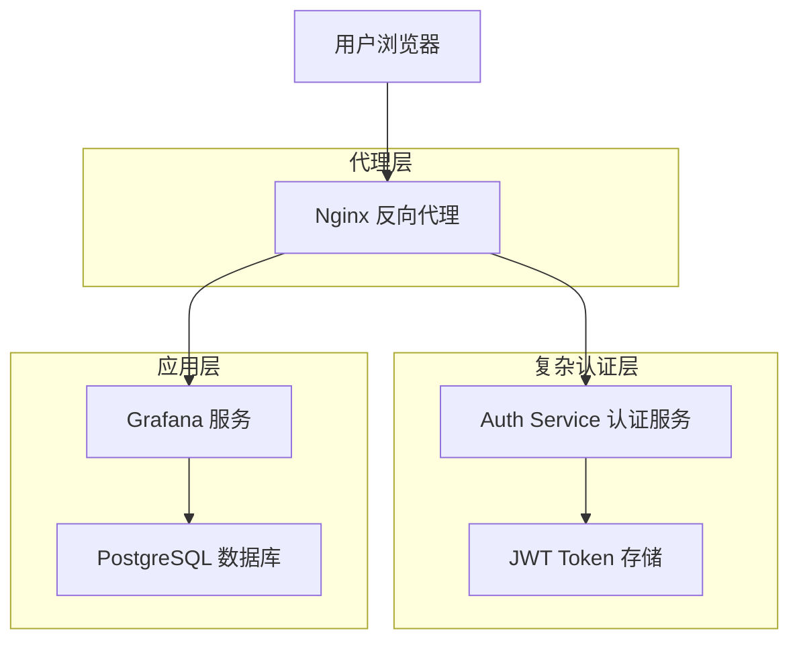
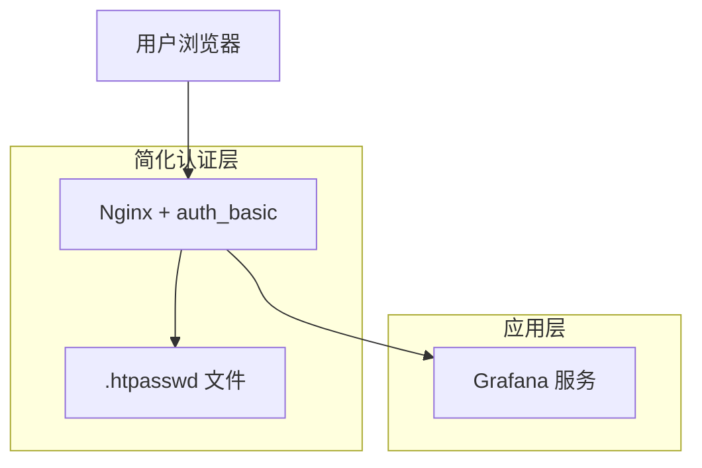
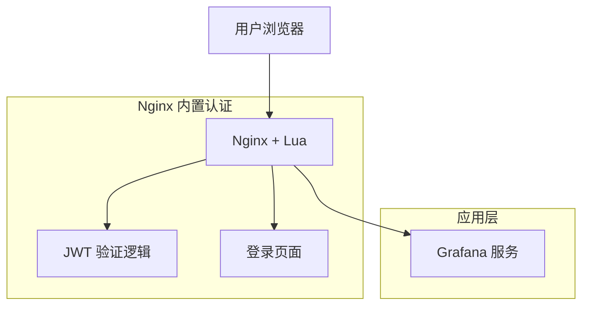
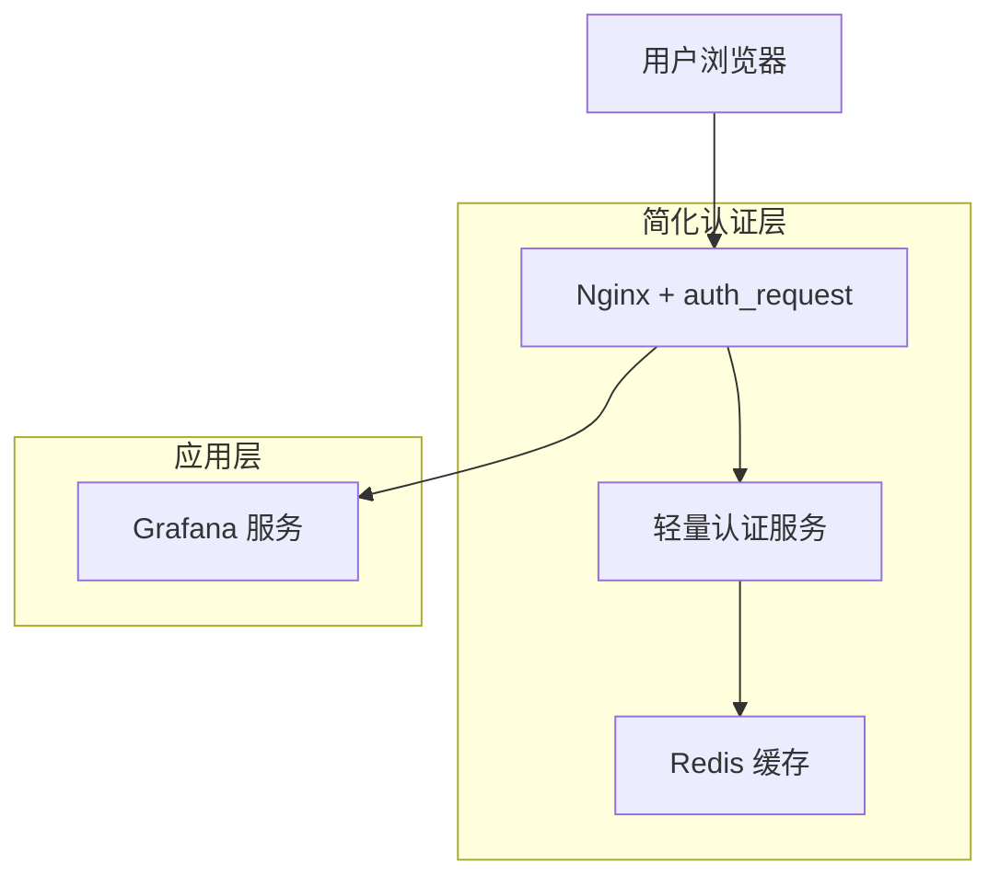

# Nginx 简化认证方案设计文档

## 1. 当前认证架构复杂性分析

### 1.1 现有架构组件



### 1.2 复杂性问题分析

#### 架构复杂性
- **多服务依赖**: 需要维护独立的认证服务
- **状态管理**: JWT Token 的生成、验证和刷新逻辑
- **网络开销**: 每次请求都需要额外的认证服务调用
- **部署复杂**: 需要管理多个容器和服务间通信

#### 运维复杂性
- **监控难度**: 需要监控认证服务的健康状态
- **故障排查**: 认证链路长，问题定位困难
- **扩展性**: 认证服务成为潜在瓶颈
- **安全风险**: 多个服务间的通信安全

#### 开发复杂性
- **代码维护**: 需要维护认证服务的业务逻辑
- **接口协调**: 认证服务与 Nginx、Grafana 的接口对接
- **测试复杂**: 需要测试完整的认证链路

## 2. Nginx 内置认证模块能力评估

### 2.1 auth_basic 模块

#### 功能特性
- **基础认证**: 支持 HTTP Basic Authentication
- **用户文件**: 基于 htpasswd 文件的用户管理
- **简单配置**: 配置简单，无需额外服务
- **广泛支持**: 所有浏览器都支持

#### 配置示例
```nginx
location /grafana/ {
    auth_basic "Grafana Access";
    auth_basic_user_file /etc/nginx/.htpasswd;
    
    # 设置认证头部
    proxy_set_header X-WEBAUTH-USER $remote_user;
    proxy_set_header X-WEBAUTH-NAME $remote_user;
    
    proxy_pass http://grafana:3000/;
}
```

#### 优缺点
**优点**:
- 配置极简，无需额外服务
- 性能开销最小
- 可靠性高

**缺点**:
- 用户体验较差（浏览器弹窗）
- 功能有限，无法自定义登录页面
- 用户管理不够灵活

### 2.2 auth_jwt 模块（第三方）

#### 功能特性
- **JWT 验证**: 直接在 Nginx 中验证 JWT Token
- **无状态**: 不需要额外的认证服务
- **高性能**: C 语言实现，性能优异
- **标准协议**: 支持标准 JWT 规范

#### 安装和配置
```bash
# 编译安装 nginx-jwt 模块
git clone https://github.com/auth0/nginx-jwt.git
./configure --add-module=nginx-jwt
make && make install
```

```nginx
http {
    # JWT 密钥配置
    jwt_key "your-secret-key";
    
    server {
        location /grafana/ {
            # JWT 验证
            access_by_lua_block {
                local jwt = require "resty.jwt"
                local jwt_token = ngx.var.cookie_grafana_jwt_token
                
                if not jwt_token then
                    ngx.status = 401
                    ngx.say("Token missing")
                    ngx.exit(401)
                end
                
                local jwt_obj = jwt:verify("your-secret-key", jwt_token)
                if not jwt_obj.valid then
                    ngx.status = 401
                    ngx.say("Invalid token")
                    ngx.exit(401)
                end
                
                # 设置用户信息头部
                ngx.req.set_header("X-WEBAUTH-USER", jwt_obj.payload.sub)
                ngx.req.set_header("X-WEBAUTH-NAME", jwt_obj.payload.name)
            }
            
            proxy_pass http://grafana:3000/;
        }
    }
}
```

### 2.3 Lua 脚本认证

#### 功能特性
- **灵活性**: 可以实现复杂的认证逻辑
- **高性能**: 基于 LuaJIT，性能优异
- **可扩展**: 支持调用外部 API 或数据库
- **实时处理**: 在请求处理过程中实时验证

#### 配置示例
```nginx
http {
    lua_package_path "/usr/local/openresty/lualib/?.lua;;";
    
    # 初始化 JWT 密钥
    init_by_lua_block {
        jwt_secret = "your-secret-key"
    }
    
    server {
        location /grafana/ {
            access_by_lua_file /etc/nginx/lua/auth.lua;
            proxy_pass http://grafana:3000/;
        }
    }
}
```

```lua
-- /etc/nginx/lua/auth.lua
local jwt = require "resty.jwt"
local cjson = require "cjson"

-- 从 Cookie 获取 Token
local jwt_token = ngx.var.cookie_grafana_jwt_token

if not jwt_token then
    -- 重定向到登录页面
    ngx.redirect("/login")
    return
end

-- 验证 JWT Token
local jwt_obj = jwt:verify(jwt_secret, jwt_token)

if not jwt_obj.valid then
    ngx.log(ngx.ERR, "Invalid JWT token: ", jwt_obj.reason)
    ngx.redirect("/login")
    return
end

-- 检查 Token 是否过期
local now = ngx.time()
if jwt_obj.payload.exp and jwt_obj.payload.exp < now then
    ngx.log(ngx.ERR, "JWT token expired")
    ngx.redirect("/login")
    return
end

-- 设置认证头部
ngx.req.set_header("X-WEBAUTH-USER", jwt_obj.payload.sub)
ngx.req.set_header("X-WEBAUTH-NAME", jwt_obj.payload.name or jwt_obj.payload.sub)
ngx.req.set_header("X-WEBAUTH-EMAIL", jwt_obj.payload.email)

-- 记录访问日志
ngx.log(ngx.INFO, "User authenticated: ", jwt_obj.payload.sub)
```

### 2.4 第三方认证模块

#### nginx-auth-ldap
```nginx
http {
    ldap_server ldap_server_1 {
        url ldap://ldap.example.com:389/dc=example,dc=com?uid?sub?(objectClass=person);
        binddn "cn=admin,dc=example,dc=com";
        binddn_passwd "password";
        group_attribute memberuid;
        group_attribute_is_dn on;
        require valid_user;
    }
    
    server {
        location /grafana/ {
            auth_ldap "LDAP Authentication";
            auth_ldap_servers ldap_server_1;
            
            proxy_set_header X-WEBAUTH-USER $remote_user;
            proxy_pass http://grafana:3000/;
        }
    }
}
```

## 3. 简化方案设计

### 3.1 方案一：基础认证 + 静态用户文件

#### 架构图


#### 实现步骤

**1. 创建用户密码文件**
```bash
# 创建 .htpasswd 文件
htpasswd -c /etc/nginx/.htpasswd admin
htpasswd /etc/nginx/.htpasswd user1
htpasswd /etc/nginx/.htpasswd user2
```

**2. 配置 Nginx**
```nginx
server {
    listen 80;
    server_name localhost 127.0.0.1;
    
    location /grafana/ {
        auth_basic "Grafana Access";
        auth_basic_user_file /etc/nginx/.htpasswd;
        
        # 设置 Grafana 需要的认证头部
        proxy_set_header X-WEBAUTH-USER $remote_user;
        proxy_set_header X-WEBAUTH-NAME $remote_user;
        
        # 其他代理头部
        proxy_set_header Host $host;
        proxy_set_header X-Real-IP $remote_addr;
        proxy_set_header X-Forwarded-For $proxy_add_x_forwarded_for;
        proxy_set_header X-Forwarded-Proto $scheme;
        
        proxy_pass http://grafana:3000/;
    }
    
    # 健康检查
    location /health {
        return 200 "OK";
        add_header Content-Type text/plain;
    }
}
```

**3. 配置 Grafana**
```ini
[auth.proxy]
enabled = true
header_name = X-WEBAUTH-USER
header_property = username
auto_sign_up = true
sync_ttl = 60
whitelist = 127.0.0.1, ::1
headers = Name:X-WEBAUTH-NAME
```

#### 优缺点分析
**优点**:
- 配置极简，无需额外服务
- 性能开销最小
- 可靠性高，故障点少
- 部署简单

**缺点**:
- 用户体验较差（浏览器弹窗）
- 用户管理不够灵活
- 无法自定义登录界面
- 不支持单点登录

### 3.2 方案二：Lua 脚本 + JWT 认证

#### 架构图


#### 实现步骤

**1. 安装 OpenResty**
```dockerfile
# Dockerfile
FROM openresty/openresty:alpine

# 安装 lua-resty-jwt
RUN /usr/local/openresty/luajit/bin/luarocks install lua-resty-jwt

COPY nginx.conf /usr/local/openresty/nginx/conf/
COPY lua/ /etc/nginx/lua/
COPY html/ /usr/local/openresty/nginx/html/

EXPOSE 80
CMD ["/usr/local/openresty/bin/openresty", "-g", "daemon off;"]
```

**2. 配置 Nginx**
```nginx
http {
    lua_package_path "/usr/local/openresty/lualib/?.lua;;";
    
    # JWT 密钥
    init_by_lua_block {
        jwt_secret = "your-256-bit-secret-key-here"
        users = {
            admin = "password123",
            user1 = "password456"
        }
    }
    
    server {
        listen 80;
        server_name localhost 127.0.0.1;
        
        # 登录页面
        location = /login {
            content_by_lua_file /etc/nginx/lua/login.lua;
        }
        
        # 登录处理
        location = /auth {
            content_by_lua_file /etc/nginx/lua/authenticate.lua;
        }
        
        # Grafana 访问
        location /grafana/ {
            access_by_lua_file /etc/nginx/lua/verify.lua;
            
            proxy_set_header Host $host;
            proxy_set_header X-Real-IP $remote_addr;
            proxy_set_header X-Forwarded-For $proxy_add_x_forwarded_for;
            proxy_set_header X-Forwarded-Proto $scheme;
            
            proxy_pass http://grafana:3000/;
        }
        
        # 根路径重定向
        location = / {
            return 302 /login;
        }
    }
}
```

**3. 登录页面 Lua 脚本**
```lua
-- /etc/nginx/lua/login.lua
local template = [[
<!DOCTYPE html>
<html>
<head>
    <title>Grafana Login</title>
    <style>
        body { font-family: Arial, sans-serif; margin: 50px; }
        .login-form { max-width: 300px; margin: 0 auto; }
        input { width: 100%; padding: 10px; margin: 10px 0; }
        button { width: 100%; padding: 10px; background: #3498db; color: white; border: none; }
    </style>
</head>
<body>
    <div class="login-form">
        <h2>Grafana Login</h2>
        <form method="POST" action="/auth">
            <input type="text" name="username" placeholder="Username" required>
            <input type="password" name="password" placeholder="Password" required>
            <button type="submit">Login</button>
        </form>
    </div>
</body>
</html>
]]

ngx.header.content_type = "text/html"
ngx.say(template)
```

**4. 认证处理 Lua 脚本**
```lua
-- /etc/nginx/lua/authenticate.lua
local jwt = require "resty.jwt"

-- 读取 POST 数据
ngx.req.read_body()
local args, err = ngx.req.get_post_args()

if not args then
    ngx.status = 400
    ngx.say("Bad Request")
    return
end

local username = args.username
local password = args.password

-- 验证用户凭据
if not username or not password or users[username] ~= password then
    ngx.status = 401
    ngx.header.content_type = "text/html"
    ngx.say([[<script>alert('Invalid credentials'); window.location='/login';</script>]])
    return
end

-- 生成 JWT Token
local jwt_token = jwt:sign(
    jwt_secret,
    {
        header = { typ = "JWT", alg = "HS256" },
        payload = {
            sub = username,
            name = username,
            exp = ngx.time() + 86400, -- 24小时过期
            iat = ngx.time()
        }
    }
)

-- 设置 Cookie
local cookie = string.format(
    "grafana_jwt_token=%s; Path=/; Max-Age=86400; HttpOnly",
    jwt_token
)
ngx.header["Set-Cookie"] = cookie

-- 重定向到 Grafana
ngx.redirect("/grafana/")
```

**5. Token 验证 Lua 脚本**
```lua
-- /etc/nginx/lua/verify.lua
local jwt = require "resty.jwt"

-- 从 Cookie 获取 Token
local jwt_token = ngx.var.cookie_grafana_jwt_token

if not jwt_token then
    ngx.redirect("/login")
    return
end

-- 验证 JWT Token
local jwt_obj = jwt:verify(jwt_secret, jwt_token)

if not jwt_obj.valid then
    ngx.log(ngx.ERR, "Invalid JWT token: ", jwt_obj.reason)
    ngx.redirect("/login")
    return
end

-- 检查过期时间
local now = ngx.time()
if jwt_obj.payload.exp and jwt_obj.payload.exp < now then
    ngx.log(ngx.ERR, "JWT token expired")
    ngx.redirect("/login")
    return
end

-- 设置认证头部
ngx.req.set_header("X-WEBAUTH-USER", jwt_obj.payload.sub)
ngx.req.set_header("X-WEBAUTH-NAME", jwt_obj.payload.name)
```

#### 优缺点分析
**优点**:
- 自定义登录界面，用户体验好
- 支持 JWT Token，标准化
- 无需额外认证服务
- 性能优异
- 配置灵活

**缺点**:
- 需要 OpenResty 或 Lua 模块
- 配置相对复杂
- 需要维护 Lua 脚本

### 3.3 方案三：外部认证 + 缓存

#### 架构图


#### 实现步骤

**1. 轻量认证服务**
```go
// main.go - 简化版认证服务
package main

import (
    "encoding/json"
    "net/http"
    "time"
    "github.com/go-redis/redis/v8"
    "github.com/golang-jwt/jwt/v5"
)

type AuthService struct {
    redis     *redis.Client
    jwtSecret []byte
    users     map[string]string
}

func (a *AuthService) verifyHandler(w http.ResponseWriter, r *http.Request) {
    // 从 Cookie 获取 Token
    cookie, err := r.Cookie("grafana_jwt_token")
    if err != nil {
        http.Error(w, "Unauthorized", 401)
        return
    }
    
    // 检查 Redis 缓存
    cached, err := a.redis.Get(r.Context(), "token:"+cookie.Value).Result()
    if err == nil {
        var user map[string]string
        json.Unmarshal([]byte(cached), &user)
        w.Header().Set("X-WEBAUTH-USER", user["username"])
        w.Header().Set("X-WEBAUTH-NAME", user["name"])
        w.WriteHeader(200)
        return
    }
    
    // 验证 JWT Token
    token, err := jwt.Parse(cookie.Value, func(token *jwt.Token) (interface{}, error) {
        return a.jwtSecret, nil
    })
    
    if err != nil || !token.Valid {
        http.Error(w, "Unauthorized", 401)
        return
    }
    
    claims := token.Claims.(jwt.MapClaims)
    username := claims["sub"].(string)
    name := claims["name"].(string)
    
    // 缓存验证结果
    userInfo := map[string]string{
        "username": username,
        "name":     name,
    }
    userJSON, _ := json.Marshal(userInfo)
    a.redis.Set(r.Context(), "token:"+cookie.Value, userJSON, 5*time.Minute)
    
    w.Header().Set("X-WEBAUTH-USER", username)
    w.Header().Set("X-WEBAUTH-NAME", name)
    w.WriteHeader(200)
}
```

**2. Docker Compose 配置**
```yaml
version: '3.8'
services:
  nginx:
    image: nginx:alpine
    ports:
      - "80:80"
    volumes:
      - ./nginx.conf:/etc/nginx/nginx.conf
    depends_on:
      - auth-service
      - grafana
  
  auth-service:
    build: ./auth-service
    environment:
      - REDIS_URL=redis://redis:6379
      - JWT_SECRET=your-secret-key
    depends_on:
      - redis
  
  redis:
    image: redis:alpine
    command: redis-server --maxmemory 128mb --maxmemory-policy allkeys-lru
  
  grafana:
    image: grafana/grafana:latest
    volumes:
      - ./grafana.ini:/etc/grafana/grafana.ini
```

## 4. 不同简化方案对比

### 4.1 方案对比表

| 特性 | 基础认证 | Lua+JWT | 外部认证+缓存 | 当前方案 |
|------|----------|---------|---------------|----------|
| **复杂度** | ⭐ | ⭐⭐⭐ | ⭐⭐ | ⭐⭐⭐⭐⭐ |
| **性能** | ⭐⭐⭐⭐⭐ | ⭐⭐⭐⭐ | ⭐⭐⭐ | ⭐⭐ |
| **用户体验** | ⭐⭐ | ⭐⭐⭐⭐ | ⭐⭐⭐⭐ | ⭐⭐⭐⭐⭐ |
| **可扩展性** | ⭐ | ⭐⭐⭐ | ⭐⭐⭐⭐ | ⭐⭐⭐⭐⭐ |
| **维护成本** | ⭐⭐⭐⭐⭐ | ⭐⭐⭐ | ⭐⭐⭐ | ⭐⭐ |
| **安全性** | ⭐⭐⭐ | ⭐⭐⭐⭐ | ⭐⭐⭐⭐ | ⭐⭐⭐⭐⭐ |

### 4.2 详细对比分析

#### 4.2.1 复杂度对比
- **基础认证**: 配置最简单，只需几行 Nginx 配置
- **Lua+JWT**: 需要编写 Lua 脚本，中等复杂度
- **外部认证+缓存**: 需要轻量服务和缓存，复杂度适中
- **当前方案**: 完整的认证服务，复杂度最高

#### 4.2.2 性能对比
- **基础认证**: 性能最优，无额外网络调用
- **Lua+JWT**: 性能优秀，在 Nginx 内部处理
- **外部认证+缓存**: 有缓存时性能好，缓存未命中时有网络开销
- **当前方案**: 每次请求都需要网络调用，性能最差

#### 4.2.3 功能对比
- **基础认证**: 功能最基础，只支持用户名密码
- **Lua+JWT**: 支持自定义登录页面和 JWT
- **外部认证+缓存**: 支持复杂认证逻辑和缓存优化
- **当前方案**: 功能最完整，支持所有认证需求

## 5. 实现步骤和配置示例

### 5.1 推荐方案：Lua + JWT 认证

基于综合考虑，推荐使用 **Lua + JWT 认证方案**，它在简化架构的同时保持了良好的用户体验和扩展性。

#### 5.1.1 环境准备

**1. 创建项目结构**
```bash
mkdir nginx-auth-simplified
cd nginx-auth-simplified

mkdir -p lua html
touch docker-compose.yml
touch nginx.conf
```

**2. Docker Compose 配置**
```yaml
# docker-compose.yml
version: '3.8'
services:
  nginx:
    image: openresty/openresty:alpine
    ports:
      - "80:80"
    volumes:
      - ./nginx.conf:/usr/local/openresty/nginx/conf/nginx.conf
      - ./lua:/etc/nginx/lua
      - ./html:/usr/local/openresty/nginx/html
    depends_on:
      - grafana
    command: ["/usr/local/openresty/bin/openresty", "-g", "daemon off;"]
  
  grafana:
    image: grafana/grafana:latest
    environment:
      - GF_AUTH_PROXY_ENABLED=true
      - GF_AUTH_PROXY_HEADER_NAME=X-WEBAUTH-USER
      - GF_AUTH_PROXY_HEADER_PROPERTY=username
      - GF_AUTH_PROXY_AUTO_SIGN_UP=true
      - GF_AUTH_PROXY_HEADERS=Name:X-WEBAUTH-NAME
      - GF_AUTH_PROXY_WHITELIST=127.0.0.1,::1
    volumes:
      - grafana-data:/var/lib/grafana
    ports:
      - "3000:3000"

volumes:
  grafana-data:
```

#### 5.1.2 完整配置文件

**1. Nginx 主配置**
```nginx
# nginx.conf
worker_processes auto;
error_log /var/log/nginx/error.log warn;

events {
    worker_connections 1024;
}

http {
    include       /usr/local/openresty/nginx/conf/mime.types;
    default_type  application/octet-stream;
    
    # 日志格式
    log_format main '$remote_addr - $remote_user [$time_local] "$request" '
                    '$status $body_bytes_sent "$http_referer" '
                    '"$http_user_agent" "$http_x_forwarded_for"';
    
    access_log /var/log/nginx/access.log main;
    
    # Lua 包路径
    lua_package_path "/usr/local/openresty/lualib/?.lua;;";
    
    # 全局初始化
    init_by_lua_block {
        -- JWT 密钥（生产环境应使用环境变量）
        jwt_secret = "your-256-bit-secret-key-change-this-in-production"
        
        -- 用户数据库（生产环境应使用外部数据源）
        users = {
            admin = "admin123",
            user1 = "password1",
            user2 = "password2",
            demo = "demo123"
        }
        
        -- 用户显示名称映射
        user_names = {
            admin = "Administrator",
            user1 = "User One",
            user2 = "User Two",
            demo = "Demo User"
        }
    }
    
    server {
        listen 80;
        server_name localhost 127.0.0.1;
        
        # 登录页面
        location = /login {
            content_by_lua_file /etc/nginx/lua/login.lua;
        }
        
        # 登录处理
        location = /auth {
            content_by_lua_file /etc/nginx/lua/authenticate.lua;
        }
        
        # 登出处理
        location = /logout {
            content_by_lua_block {
                -- 清除 Cookie
                ngx.header["Set-Cookie"] = "grafana_jwt_token=; Path=/; Max-Age=0; HttpOnly"
                ngx.redirect("/login")
            }
        }
        
        # Grafana 访问（受保护）
        location /grafana/ {
            access_by_lua_file /etc/nginx/lua/verify.lua;
            
            # 代理头部设置
            proxy_set_header Host $host;
            proxy_set_header X-Real-IP $remote_addr;
            proxy_set_header X-Forwarded-For $proxy_add_x_forwarded_for;
            proxy_set_header X-Forwarded-Proto $scheme;
            
            # 代理到 Grafana
            proxy_pass http://grafana:3000/;
        }
        
        # 根路径重定向
        location = / {
            return 302 /login;
        }
        
        # 健康检查
        location = /health {
            return 200 "OK";
            add_header Content-Type text/plain;
        }
        
        # 静态资源
        location /static/ {
            alias /usr/local/openresty/nginx/html/;
        }
    }
}
```

**2. 登录页面脚本**
```lua
-- lua/login.lua
local template = [[
<!DOCTYPE html>
<html lang="zh-CN">
<head>
    <meta charset="UTF-8">
    <meta name="viewport" content="width=device-width, initial-scale=1.0">
    <title>Grafana 登录</title>
    <style>
        * {
            margin: 0;
            padding: 0;
            box-sizing: border-box;
        }
        
        body {
            font-family: -apple-system, BlinkMacSystemFont, 'Segoe UI', Roboto, sans-serif;
            background: linear-gradient(135deg, #667eea 0%, #764ba2 100%);
            min-height: 100vh;
            display: flex;
            align-items: center;
            justify-content: center;
        }
        
        .login-container {
            background: white;
            padding: 2rem;
            border-radius: 10px;
            box-shadow: 0 15px 35px rgba(0, 0, 0, 0.1);
            width: 100%;
            max-width: 400px;
        }
        
        .login-header {
            text-align: center;
            margin-bottom: 2rem;
        }
        
        .login-header h1 {
            color: #333;
            font-size: 2rem;
            margin-bottom: 0.5rem;
        }
        
        .login-header p {
            color: #666;
            font-size: 0.9rem;
        }
        
        .form-group {
            margin-bottom: 1.5rem;
        }
        
        .form-group label {
            display: block;
            margin-bottom: 0.5rem;
            color: #333;
            font-weight: 500;
        }
        
        .form-group input {
            width: 100%;
            padding: 0.75rem;
            border: 2px solid #e1e5e9;
            border-radius: 5px;
            font-size: 1rem;
            transition: border-color 0.3s;
        }
        
        .form-group input:focus {
            outline: none;
            border-color: #667eea;
        }
        
        .login-button {
            width: 100%;
            padding: 0.75rem;
            background: linear-gradient(135deg, #667eea 0%, #764ba2 100%);
            color: white;
            border: none;
            border-radius: 5px;
            font-size: 1rem;
            font-weight: 500;
            cursor: pointer;
            transition: transform 0.2s;
        }
        
        .login-button:hover {
            transform: translateY(-2px);
        }
        
        .demo-info {
            margin-top: 1.5rem;
            padding: 1rem;
            background: #f8f9fa;
            border-radius: 5px;
            font-size: 0.85rem;
            color: #666;
        }
        
        .demo-info h4 {
            color: #333;
            margin-bottom: 0.5rem;
        }
        
        .demo-accounts {
            display: grid;
            grid-template-columns: 1fr 1fr;
            gap: 0.5rem;
            margin-top: 0.5rem;
        }
        
        .demo-account {
            font-family: monospace;
            font-size: 0.8rem;
        }
    </style>
</head>
<body>
    <div class="login-container">
        <div class="login-header">
            <h1>🔐 Grafana</h1>
            <p>请登录以访问 Grafana 仪表板</p>
        </div>
        
        <form method="POST" action="/auth">
            <div class="form-group">
                <label for="username">用户名</label>
                <input type="text" id="username" name="username" required autocomplete="username">
            </div>
            
            <div class="form-group">
                <label for="password">密码</label>
                <input type="password" id="password" name="password" required autocomplete="current-password">
            </div>
            
            <button type="submit" class="login-button">登录</button>
        </form>
        
        <div class="demo-info">
            <h4>演示账户</h4>
            <div class="demo-accounts">
                <div class="demo-account">admin / admin123</div>
                <div class="demo-account">demo / demo123</div>
                <div class="demo-account">user1 / password1</div>
                <div class="demo-account">user2 / password2</div>
            </div>
        </div>
    </div>
</body>
</html>
]]

-- 检查是否已经登录
local jwt_token = ngx.var.cookie_grafana_jwt_token
if jwt_token then
    local jwt = require "resty.jwt"
    local jwt_obj = jwt:verify(jwt_secret, jwt_token)
    
    if jwt_obj.valid and jwt_obj.payload.exp > ngx.time() then
        -- 已登录，重定向到 Grafana
        ngx.redirect("/grafana/")
        return
    end
end

-- 显示登录页面
ngx.header.content_type = "text/html; charset=utf-8"
ngx.say(template)
```

**3. 认证处理脚本**
```lua
-- lua/authenticate.lua
local jwt = require "resty.jwt"

-- 读取 POST 数据
ngx.req.read_body()
local args, err = ngx.req.get_post_args()

if not args then
    ngx.status = 400
    ngx.header.content_type = "text/html; charset=utf-8"
    ngx.say([[<script>alert('请求格式错误'); window.location='/login';</script>]])
    return
end

local username = args.username
local password = args.password

-- 验证输入
if not username or not password then
    ngx.status = 400
    ngx.header.content_type = "text/html; charset=utf-8"
    ngx.say([[<script>alert('用户名和密码不能为空'); window.location='/login';</script>]])
    return
end

-- 验证用户凭据
if users[username] ~= password then
    ngx.log(ngx.WARN, "Login failed for user: ", username)
    ngx.status = 401
    ngx.header.content_type = "text/html; charset=utf-8"
    ngx.say([[<script>alert('用户名或密码错误'); window.location='/login';</script>]])
    return
end

-- 生成 JWT Token
local now = ngx.time()
local exp = now + 86400 -- 24小时过期

local jwt_token = jwt:sign(
    jwt_secret,
    {
        header = { 
            typ = "JWT", 
            alg = "HS256" 
        },
        payload = {
            sub = username,
            name = user_names[username] or username,
            exp = exp,
            iat = now,
            iss = "nginx-auth",
            aud = "grafana"
        }
    }
)

if not jwt_token then
    ngx.log(ngx.ERR, "Failed to generate JWT token for user: ", username)
    ngx.status = 500
    ngx.header.content_type = "text/html; charset=utf-8"
    ngx.say([[<script>alert('登录失败，请稍后重试'); window.location='/login';</script>]])
    return
end

-- 设置 Cookie
local cookie = string.format(
    "grafana_jwt_token=%s; Path=/; Max-Age=86400; HttpOnly; SameSite=Lax",
    jwt_token
)
ngx.header["Set-Cookie"] = cookie

-- 记录登录日志
ngx.log(ngx.INFO, "User logged in successfully: ", username)

-- 重定向到 Grafana
ngx.redirect("/grafana/")
```

**4. Token 验证脚本**
```lua
-- lua/verify.lua
local jwt = require "resty.jwt"

-- 从 Cookie 获取 Token
local jwt_token = ngx.var.cookie_grafana_jwt_token

if not jwt_token then
    ngx.log(ngx.INFO, "No JWT token found, redirecting to login")
    ngx.redirect("/login")
    return
end

-- 验证 JWT Token
local jwt_obj = jwt:verify(jwt_secret, jwt_token)

if not jwt_obj.valid then
    ngx.log(ngx.WARN, "Invalid JWT token: ", jwt_obj.reason or "unknown")
    -- 清除无效 Cookie
    ngx.header["Set-Cookie"] = "grafana_jwt_token=; Path=/; Max-Age=0; HttpOnly"
    ngx.redirect("/login")
    return
end

-- 检查过期时间
local now = ngx.time()
if jwt_obj.payload.exp and jwt_obj.payload.exp < now then
    ngx.log(ngx.INFO, "JWT token expired for user: ", jwt_obj.payload.sub or "unknown")
    -- 清除过期 Cookie
    ngx.header["Set-Cookie"] = "grafana_jwt_token=; Path=/; Max-Age=0; HttpOnly"
    ngx.redirect("/login")
    return
end

-- 设置认证头部
local username = jwt_obj.payload.sub
local display_name = jwt_obj.payload.name or username

ngx.req.set_header("X-WEBAUTH-USER", username)
ngx.req.set_header("X-WEBAUTH-NAME", display_name)

-- 记录访问日志
ngx.log(ngx.INFO, "User authenticated: ", username, " accessing: ", ngx.var.request_uri)
```

#### 5.1.3 部署和测试

**1. 启动服务**
```bash
# 启动所有服务
docker-compose up -d

# 查看日志
docker-compose logs -f nginx
```

**2. 测试认证流程**
```bash
# 测试登录页面
curl -I http://localhost/

# 测试登录
curl -X POST http://localhost/auth \
  -d "username=admin&password=admin123" \
  -v

# 测试 Grafana 访问
curl -b "grafana_jwt_token=<token>" http://localhost/grafana/
```

**3. 验证功能**
- 访问 `http://localhost/` 应该重定向到登录页面
- 使用演示账户登录应该成功
- 登录后应该能正常访问 Grafana
- 登出后应该清除认证状态

## 6. 简化后的优缺点分析

### 6.1 优点分析

#### 6.1.1 架构简化
- **减少组件**: 从 4 个服务减少到 2 个服务（Nginx + Grafana）
- **消除依赖**: 不再需要独立的认证服务和数据库
- **简化部署**: Docker Compose 配置更简单
- **降低复杂度**: 认证逻辑集中在 Nginx 中

#### 6.1.2 性能提升
- **减少网络调用**: 认证在 Nginx 内部完成
- **降低延迟**: 无需额外的 HTTP 请求
- **提高吞吐量**: Lua 脚本性能优异
- **减少资源消耗**: 更少的容器和进程

#### 6.1.3 运维简化
- **监控简化**: 只需监控 Nginx 和 Grafana
- **日志集中**: 认证日志在 Nginx 中统一管理
- **故障排查**: 认证链路更短，问题定位更容易
- **扩展简单**: 只需扩展 Nginx 实例

#### 6.1.4 成本降低
- **资源节省**: 更少的 CPU 和内存消耗
- **维护成本**: 更少的代码需要维护
- **学习成本**: 团队只需掌握 Nginx 和 Lua

### 6.2 缺点分析

#### 6.2.1 功能限制
- **认证方式**: 相比完整认证服务功能有限
- **用户管理**: 无法动态管理用户
- **集成能力**: 与第三方系统集成较困难
- **审计功能**: 缺少详细的审计日志

#### 6.2.2 扩展性限制
- **复杂认证**: 无法支持复杂的认证逻辑
- **多租户**: 不支持多租户架构
- **权限控制**: 细粒度权限控制有限
- **SSO 集成**: 单点登录集成较困难

#### 6.2.3 技术依赖
- **Lua 技能**: 需要团队掌握 Lua 编程
- **OpenResty**: 依赖特定的 Nginx 发行版
- **调试难度**: Lua 脚本调试相对困难
- **版本兼容**: 需要注意 Lua 库的版本兼容性

## 7. 适用场景和限制条件

### 7.1 适用场景

#### 7.1.1 小型团队
- **用户数量**: 10-50 人的小型团队
- **认证需求**: 基础的用户名密码认证
- **维护能力**: 有限的运维资源
- **成本敏感**: 对基础设施成本敏感

#### 7.1.2 内部系统
- **网络环境**: 内网或受信任环境
- **安全要求**: 中等安全要求
- **用户变动**: 用户变动不频繁
- **功能需求**: 基础的监控和可视化需求

#### 7.1.3 快速原型
- **开发阶段**: 快速原型和概念验证
- **时间压力**: 需要快速上线
- **功能验证**: 验证 Grafana 功能是否满足需求
- **后续迁移**: 后续可能迁移到完整方案

#### 7.1.4 边缘部署
- **资源限制**: 边缘设备资源有限
- **网络条件**: 网络不稳定或带宽有限
- **离线需求**: 需要支持离线运行
- **简化运维**: 减少运维复杂度

### 7.2 限制条件

#### 7.2.1 技术限制
- **Nginx 版本**: 需要支持 Lua 的 Nginx（OpenResty）
- **Lua 依赖**: 需要安装 lua-resty-jwt 等库
- **性能限制**: 大量并发时 Lua 脚本可能成为瓶颈
- **内存限制**: JWT Token 和用户信息存储在内存中

#### 7.2.2 功能限制
- **用户管理**: 无法动态添加/删除用户
- **密码策略**: 无法实施复杂的密码策略
- **会话管理**: 无法主动撤销用户会话
- **审计日志**: 缺少详细的用户行为审计

#### 7.2.3 安全限制
- **密钥管理**: JWT 密钥硬编码在配置中
- **密码存储**: 用户密码明文存储（演示用）
- **HTTPS**: 生产环境必须使用 HTTPS
- **跨域**: 可能存在跨域安全问题

#### 7.2.4 扩展限制
- **水平扩展**: 多实例间状态同步困难
- **第三方集成**: 与 LDAP、OAuth 等集成困难
- **多应用**: 难以支持多个应用的统一认证
- **复杂权限**: 无法实现基于角色的访问控制

### 7.3 迁移建议

#### 7.3.1 何时考虑迁移
- **用户增长**: 用户数量超过 100 人
- **功能需求**: 需要复杂的认证功能
- **集成需求**: 需要与企业系统集成
- **合规要求**: 需要满足审计和合规要求

#### 7.3.2 迁移路径
1. **渐进式迁移**: 保持 Nginx 代理，替换认证后端
2. **数据迁移**: 将用户数据迁移到数据库
3. **功能增强**: 逐步添加高级认证功能
4. **完整替换**: 最终替换为完整的认证系统

## 8. 总结和建议

### 8.1 方案总结

通过 Nginx 简化认证逻辑是一个可行的方案，特别适合以下场景：

1. **小型团队或项目**: 用户数量有限，认证需求简单
2. **快速部署**: 需要快速上线 Grafana 监控系统
3. **资源受限**: 基础设施资源有限，需要降低成本
4. **内部使用**: 在受信任的内网环境中使用

### 8.2 推荐方案

基于分析，推荐使用 **Lua + JWT 认证方案**：

- ✅ **平衡性好**: 在简化和功能之间取得良好平衡
- ✅ **用户体验**: 提供自定义登录界面
- ✅ **标准化**: 使用标准的 JWT Token
- ✅ **性能优异**: Lua 脚本性能优秀
- ✅ **可扩展**: 后续可以逐步增强功能

### 8.3 实施建议

#### 8.3.1 生产环境配置
1. **使用 HTTPS**: 确保所有通信加密
2. **环境变量**: JWT 密钥使用环境变量
3. **密码加密**: 用户密码使用哈希存储
4. **日志监控**: 配置详细的访问和错误日志
5. **备份策略**: 定期备份配置和用户数据

#### 8.3.2 安全加固
```lua
-- 密码哈希验证示例
local bcrypt = require "bcrypt"

-- 存储哈希密码
users = {
    admin = bcrypt.digest("admin123", 12),
    user1 = bcrypt.digest("password1", 12)
}

-- 验证密码
if not bcrypt.verify(password, users[username]) then
    -- 认证失败
end
```

#### 8.3.3 监控配置
```nginx
# 添加认证指标
location = /metrics {
    content_by_lua_block {
        -- 输出 Prometheus 格式指标
        ngx.say("# HELP auth_requests_total Total authentication requests")
        ngx.say("# TYPE auth_requests_total counter")
        ngx.say("auth_requests_total{status=\"success\"} ", success_count)
        ngx.say("auth_requests_total{status=\"failed\"} ", failed_count)
    }
}
```

### 8.4 后续演进

随着业务发展，可以考虑以下演进路径：

1. **阶段一**: 使用简化的 Nginx 认证方案
2. **阶段二**: 添加外部用户数据源（数据库、LDAP）
3. **阶段三**: 集成企业 SSO 系统
4. **阶段四**: 迁移到完整的身份认证平台

通过这种渐进式的演进，可以在保持系统稳定的同时，逐步满足不断增长的业务需求。
